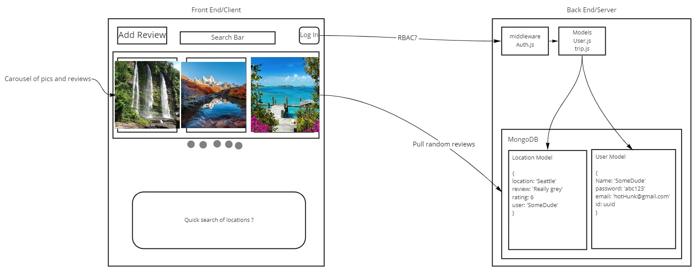
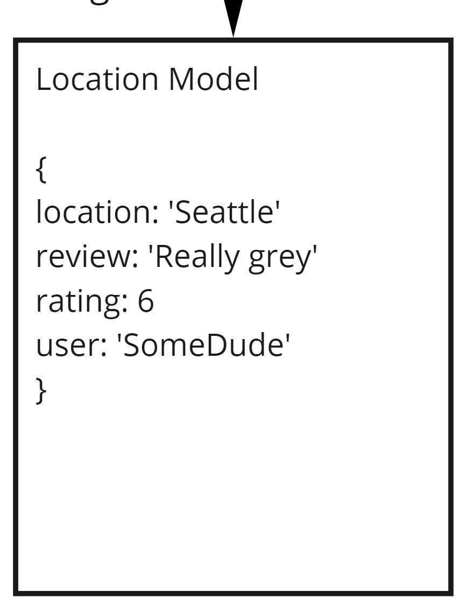
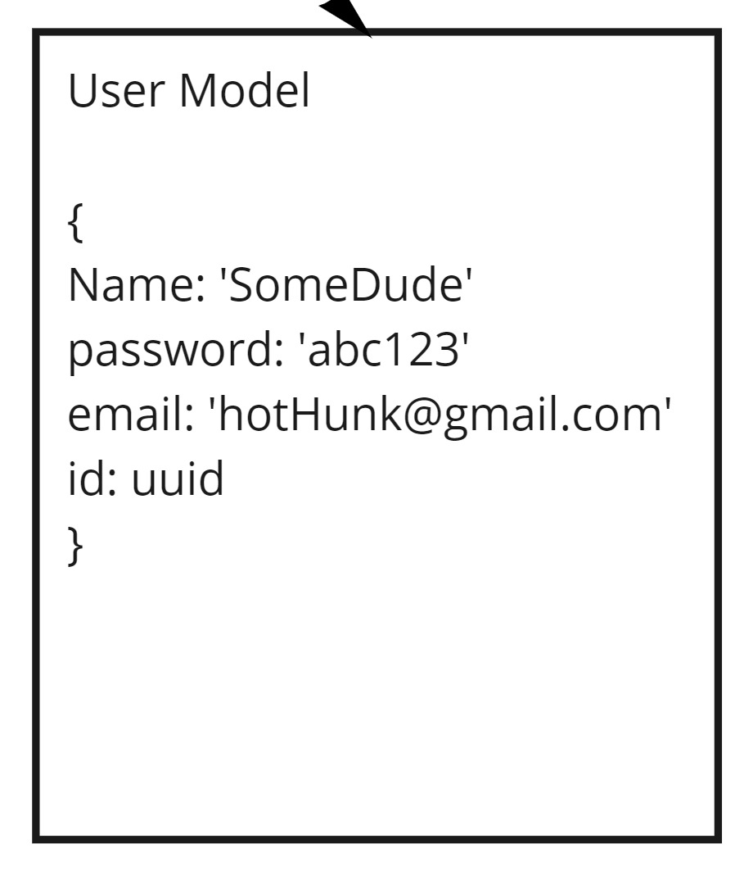

## Wireframe

## Data Model

* This data model represents each entry for a given location.

* This data model represents each user added to the database.

## Software Requirements:

Frontend:
* React
* MUI (or some styling helper)
* Axios

Backend:
* MongoDB
